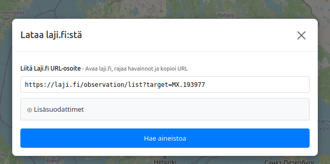
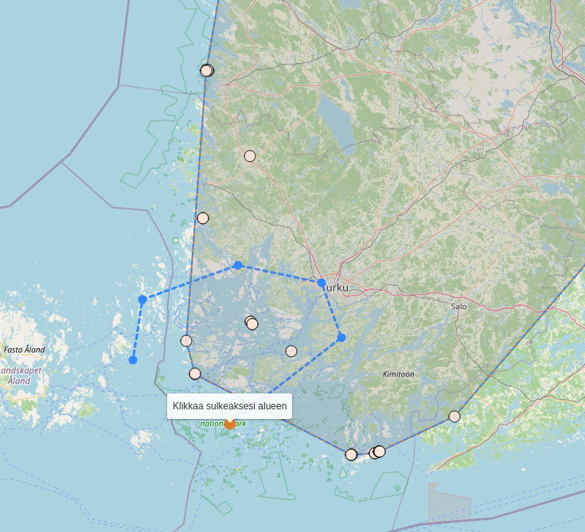
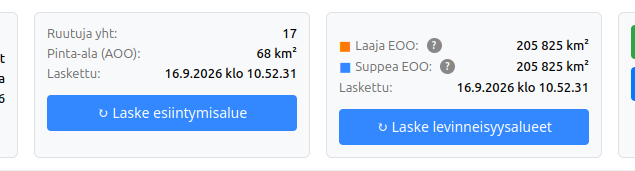

# Käyttöohje arvioijalle

Sovellus auttaa IUCN:n punaisen listan arvioinneissa tarvittavien Area Of Occupancy (AOO) ja Extent Of Occurrences (EOO) -tunnuslukujen laskennassa.

## Aloittaminen

1. Kirjaudu Laji.fi-tunnuksillasi Lajitietokeskuksen IUCN-editoriin.
2. Avaa arvioitava laji IUCN-editorissa ja siirry lajin karttanäkymään editorin linkistä.

## Havaintoaineiston lataaminen

Voit ladata aineistoa Laji.fi:stä tai omalta koneeltasi. Voit myös ladata useita aineistoja ja käsitellä niitä kartalla erikseen.

### Lataa laji.fi:stä

1. Valitse **Lataa laji.fi:stä**.
2. Avaa toisessa välilehdessä laji.fi:n havaintohaku, tee tarvitsemasi rajaukset ja kopioi haun URL-osoite kokonaisuudessaan.
3. Liitä osoite latausikkunaan. 
4. Vaihtoehtoisesti voit määrittää filttereitä myös suoraan karttatyökalussa, mutta vaihtoehdot ovat suppeammat. Siinä voit filtteröidä koordinaattien tarkkuuden, havaintoajan, yksilömäärän, aineistotyypin ja havainnon laadun perusteella, jotka löytyvät "Lisäsuodattimet" kohdasta.
4. Valitse **Hae aineistoa** ja anna sovelluksen ladata dataa hetken aikaa.
5. Valitse lopuksi **Tallenna aineisto**, jotta havainnot tulevat kartalle näkyviin..



Hakuun voi sisältyä enintään 10 000 havaintoa. Jos raja ylittyy, rajaa hakua laji.fi:ssä esimerkiksi ajan, alueen, aineiston tai laadun perusteella.

### Lataa CSV koneelta

Valitse **Lataa CSV koneelta** ja vedä tiedosto ikkunaan tai valitse se koneeltasi. Tiedoston tulee olla UTF-8-koodattu CSV- tai TSV-tiedosto. Erotin (eli pilkku tai tab) tunnistetaan automaattisesti.

Jokaisella laskentaan tulevalla rivillä täytyy olla sijaintitieto jommallakummalla seuraavista tavoista:

- WKT-geometria sarakkeessa `wkt`, `geometry`, `geom`, `wgs84 wkt`, `wgs84wkt` tai `geometry_wkt`. WKT voi olla piste, viiva tai alue.
- Pistehavaintojen leveys- ja pituusasteet omissa sarakkeissaan. Leveysasteen sarakkeen nimi voi olla `lat`, `latitude` tai `y`; pituusasteen `lon`, `lng`, `longitude` tai `x`.

Käytä vain yhtä tapaa koordinaateille, per tiedosto!

Koordinaattien tulee olla WGS84-koordinaatteja: leveysaste ensin ja pituusaste toisena, tai WKT-muodossa. Muut sarakkeet säilyvät havaintojen taustatietoina. Riville, jolta puuttuu kelvollinen sijainti, ei muodostu karttahavaintoa.

Esimerkki pistehavainnoista:

```csv
lat,lon,nimi,paivays
60.1699,24.9384,Havainto 1,2024-01-15
60.1700,24.9385,Havainto 2,2024-01-16
```

tai

```csv
wkt,nimi,paivays
"POINT (60.1699 24.9384)",Havainto 1,2024-01-15
"POINT (60.1700 24.9385)",Havainto 2,2024-01-16
```


## Kartan käyttäminen

Klikkaa havaintoa nähdäksesi sen keskeiset tiedot, kuten paikan, ajan, yksilömäärän, havainnon laadun ja koordinaattien tarkkuuden. Samassa ikkunassa voit valita **Piilota**, jolloin havainto jää kartalle harmaana mutta ei sisälly AOO- tai EOO-laskentaan. **Sisällytä** palauttaa havainnon laskentaan.

Aluemuotoisen havainnon voi tarvittaessa muuntaa sen keskipisteeksi. Pistettä voi siirtää havainnon epätarkkuussäteen sisällä. Muutetun geometrian voi aina palauttaa alkuperäiseksi. Tee tällaiset muutokset vain, kun ne ovat arvioinnin kannalta perusteltuja.

Voit käsitellä useita havaintoja kerralla seuraavasti:

1. Valitse kartan oikeasta yläkulmasta **Valitse useita aluerajauksella**.
2. Piirrä vähintään kolmesta pisteestä muodostuva alue ja sulje se kaksoisklikkaamalla tai klikkaamalla aloituspistettä.
3. Valitse avautuvasta ikkunasta, otetaanko alueen havainnot käyttöön, poistetaanko ne laskennasta vai muunnetaanko alueen aluemaiset havainnot keskipisteiksi.



Painikkeella **piilota nollahavainnot** voit poistaa laskennasta havainnot, joiden yksilömäärä on alle yksi.

Kartan **Karttavalinnat**-paneelissa voit vaihtaa taustakarttaa sekä näyttää eliömaakunnat ja uhanalaisuusarviointialueet. Paneelissa voit myös ottaa kokonaisen aineiston käyttöön tai pois käytöstä, avata sen taulukkona ja poistaa aineiston. Karttasymbolin väri kertoo koordinaattien tarkkuusluokan. Punainen havainto sisältyy analyysiin ja harmaa on poistettu analyysistä.

## AOO ja EOO

Kun aineisto on tarkistettu, laske tunnusluvut yläreunan painikkeilla.



- **Laske esiintymisalue** muodostaa AOO:n 2 x 2 km ruuduista. AOO on käytännössä ruutujen lukumäärä kerrottuna neljällä neliökilometrillä. Kartalla näkyvät laskentaan sisältyvät ruudut.
- **Laske levinneisyysalueet** muodostaa EOO:n havaintogeometrioiden ympärille. Laskentaan tarvitaan vähintään kolme analyysiin sisällytettyä havaintoa.
- **Laaja EOO** käyttää havaintogeometrioiden kaikkia pisteitä ja kuvaa suurinta mahdollista levinneisyysaluetta.
- **Suppea EOO** käyttää aluemaisesta havainnosta sitä nurkkausta, joka on lähimpänä havaintojen yhteistä keskusta. Se vähentää laajojen havaintoalueiden vaikutusta tulokseen.

Laskennassa käytetään vain analyysiin sisällytettyjä, kartalle sijoittuvia havaintoja. Jos piilotat, palautat, siirrät tai muutat havaintoja, laske AOO ja EOO uudelleen. Laskennan ajankohta näkyy tulosten yhteydessä.

## Tulosten tulkinta

Tarkista ennen arvojen kirjaamista erityisesti seuraavat asiat:

- Aineisto vastaa arvioinnin ajallista, maantieteellistä ja taksonomista rajausta.
- Epävarmat, virheelliset tai arvioinnin kannalta muuten sopimattomat havainnot on poistettu laskennasta perustellusti.
- Epätarkkojen pisteiden ja laajojen aluerajausten vaikutus on arvioitu. Aluemainen havainto voi kattaa useita AOO-ruutuja ja kasvattaa myös laajaa EOO:ta.
- AOO ja EOO kuvaavat käytettyä aineistoa, eivät suoraan lajin todellista esiintymis- tai levinneisyysaluetta.

Sovellus ei päättele IUCN-luokkaa eikä korvaa IUCN-kriteerien muuta tulkintaa. Kirjaa tarkistetut AOO- ja EOO-arvot IUCN-editorin arviointiin ja halutessasi perustele aineiston rajaukset arvioinnin muistiinpanoissa.
